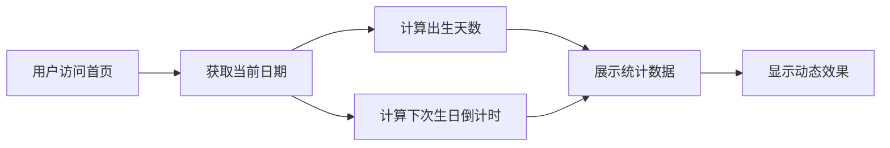

## 1. Product Overview
一个有趣的个人生日倒计时网站，展示从出生到现在的天数统计，以及下一个生日的倒计时。目标用户是想要记录和庆祝生日的个人用户。

## 2. Core Features

### 2.2 Feature Module
1. **Home page**: 生日倒计时卡片、出生天数统计、动态背景效果、趣味动画

### 2.3 Page Details
| Page Name | Module Name | Feature description |
|-----------|-------------|---------------------|
| Home page | 生日倒计时卡片 | 显示出生日期、年龄、距下次生日天数、出生总天数 |
| Home page | 动态背景 | 粒子效果或渐变动画背景 |
| Home page | 趣味数据 | 显示人生已过百分比、星座、生肖等有趣信息 |

## 3. Core Process
用户访问首页 → 系统自动计算出生天数和生日倒计时 → 展示动态效果和统计数据

## 4. User Interface Design
### 4.1 Design Style
- Primary color: #FF6B6B (珊瑚红)
- Secondary color: #4ECDC4 (青绿)
- Accent color: #FFE66D (金黄色)
- Button style: rounded-lg, gradient background
- Font: 'Pacifico' (装饰字体) + 'Inter' (正文)
- Layout style: 卡片式居中布局
- Animation: 柔和的浮动动画、数字跳动效果

### 4.2 Page Design Overview
| Page Name | Module Name | UI Elements |
|-----------|-------------|-------------|
| Home page | Hero Section | 渐变背景、动态粒子效果、居中卡片 |
| Home page | Countdown Card | 圆形头像区域、数字倒计时显示、装饰性图标 |
| Home page | Stats Section | 三列统计卡片、悬停动效 |

### 4.3 Responsiveness
- Desktop-first design with mobile-adaptive layout
- Touch-friendly button sizes
- Responsive font scaling

### 4.4 3D Scene Guidance (if applicable)
- 使用CSS 3D变换创建卡片悬浮效果
- 粒子背景动画增强视觉吸引力
