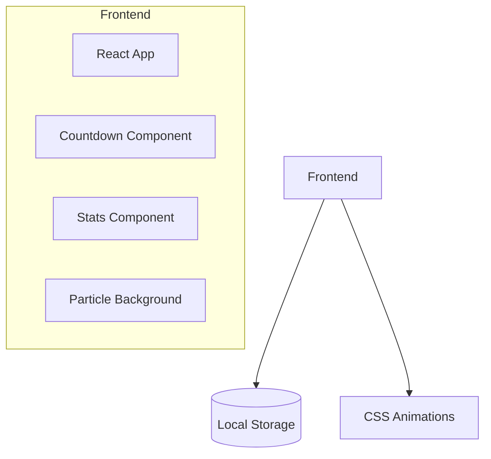

## 1. Architecture Design


## 2. Technology Description
- Frontend: React@18 + TypeScript + tailwindcss@3 + vite
- Initialization Tool: vite-init
- Backend: None (纯前端应用)
- Database: None

## 3. Route Definitions
| Route | Purpose |
|-------|---------|
| / | 首页，展示生日倒计时和统计信息 |

## 4. API Definitions
无后端API，纯前端计算

## 5. Data Model
### 5.1 Birth Date Configuration
```typescript
interface BirthConfig {
  date: string; // "2003-12-23"
  name: string; // 用户名称
}
```

### 5.2 Calculated Stats
```typescript
interface BirthdayStats {
  daysSinceBirth: number;
  nextBirthdayDays: number;
  age: number;
  zodiacSign: string;
  chineseZodiac: string;
  lifePercentage: number;
}
```

## 6. Component Structure
```
src/
├── components/
│   ├── CountdownCard.tsx    # 倒计时卡片
│   ├── StatsCard.tsx        # 统计卡片
│   └── ParticleBackground.tsx # 粒子背景
├── hooks/
│   └── useBirthday.ts       # 生日计算逻辑
├── utils/
│   └── dateUtils.ts         # 日期工具函数
├── App.tsx
├── main.tsx
└── index.css
```
